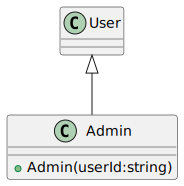
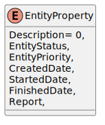
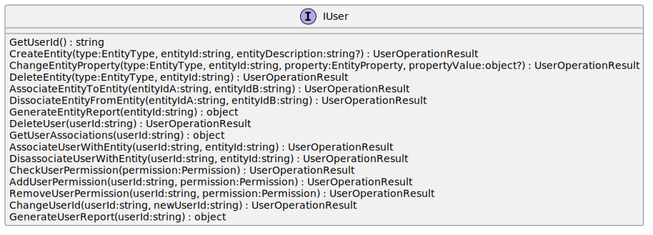

## Team 6: Project Management System
#### V1.0

------------

## Table of Contents

- Introduction
- Core Architecture
- UML Diagrams
- Classes
- Implementation Decisions
- Deployment Instructions

## Introduction
In this project, the objective is to collaboratively design and implement a comprehensive Project Management System using Polymorphism, Inheritance, Abstraction, and Encapsulation.

###  Objectives

The system aims to streamline projects, task allocation, and reporting, fostering better collaboration and productivity with a flexible system capable of expansion. By utilizing Inheritance, the system ensures reusability and hierarchical relationships between classes, while Abstraction focuses on simplifying the complexity of operations for the end-user.

Encapsulation safeguards the integrity of the data, maintaining security and coherence across tasks. Lastly, Polymorphism enables the system to adapt seamlessly to diverse project requirements and use cases.

###  Team Goal

This project not only emphasizes technical proficiency but also promotes teamwork, problem-solving, and innovation on Team 6, as we aim to deliver a practical tool for real-world applications with this project.

## Core Architecture

The core of the Project Task Management System revolves around the application of Object-Oriented Programming (OOP) principles to design a modular, flexible, and scalable architecture. The team began with a core outline in how to tease out the rest of the process such as seen in the below image:


> Screenshot: Core Outline

This core architecture highlights the carefully structured relationships, ensuring seamless task and project management functionality. The MVP contains the PMS Core where all key actions related to Project Management are contained, while other areas are connected by API calls for control & flexibility. 

The PMS Client is where we contain the users of the system & interface for interactions, while PMS Crypto is another component to help with encrypting user passwords that is built into ASP.Net called Cross-Platform Cryptography. We also used one of the utilities of the framework called gRPC.

To maintain persistent storing of information the team decided to have a Json structure of a client/server relationship. This is very good for parsing and serializing data for the project with C#. These are micro-services and the overall Core Architecture planned.

###  Encapsulation

Each class is designed to encapsulate its attributes and behaviors, such as a Task class containing properties like name, priority, and status, along with methods for updating progress or assigning users. This encapsulation ensures data integrity and controlled access through setters and getters.

###  Inheritance

A hierarchical design allows shared functionalities to propagate across related entities. For example, a User class serves as a superclass (parent), with specialized subclasses like Admin, ProductOwner, Developer and Tester inheriting core methods such as register / login authentication while introducing unique functionalities like user management and task assignment.

###  Polymorphism

The system supports dynamic behavior through polymorphism, enabling multiple forms of actions under a common interface. For instance, a generateReport() method can be implemented differently across classes to produce outputs, such as individual task progress or overall project status.

###  Abstraction

High-level interfaces abstract the underlying complexities of task management.

Database Integration: The system employs a json setup (database) to store and manage critical information. Relationships like one-to-many (e.g., one project containing many tasks) are mapped effectively using OOP concepts, ensuring consistent and logical data representation.

Scalability and Modularity: With an emphasis on modular design, the system is scalable, allowing new features to be integrated without disrupting existing functionality.

By combining these OOP principles with efficient planning choices, the system ensures robust performance, maintainability, and adaptability to varied project management needs.

## UML Diagrams

During the planning phase the team worked on various UML diagrams such as the following:


> Screenshot: UML Diagram 1

------------

Researching the needs & objectives further, the team broke this down into key highlights:

- A system capable of registering different types of  Users of different types  and assign role-specific permissions
- A system capable of creating different types of projects
- A system capable of creating different Project Items
- A system capable of managing different  task states and track any progress
- A system capable of managing different states of the project
- A system capable of generating reports on tasks
- A system  capable of allowing users to track their progress
- A system capable of generating project reports
- A system capable of retaining data over cycles
- A system capable of allocating and deallocating users to projects and tasks
- A system capable of Role-based access

This led to enhancing the UML Diagrams.


> Screenshot: Admin class diagram


> Screenshot: AssociationStatus enum class diagram


> Screenshot: AssociationType enum class diagram


> Screenshot: Developer class diagram


> Screenshot: Entity abstract class diagram


> Screenshot: EntityJsonConverter class diagram


> Screenshot: EntityPriority enum class diagram


> Screenshot: EntityProperty enum class diagram


> Screenshot: EntityState enum class diagram


> Screenshot: EntityStatus enum class diagram


> Screenshot: EntityType enum class diagram


> Screenshot: IUser interface class diagram


> Screenshot: Permission enum class diagram


> Screenshot: PmsCoreMenu class diagram


> Screenshot: PmsLogger class diagram


> Screenshot: PmsLoggerProvider class diagram


> Screenshot: Program main class diagram


> Screenshot: Project class diagram


> Screenshot: ProjectManager class diagram


> Screenshot: StateManager class diagram


> Screenshot: Task class diagram


> Screenshot: Tester class diagram


> Screenshot: User abstract class diagram


> Screenshot: UserJsonConverter class diagram


> Screenshot: UserOperationResult enum class diagram


> Screenshot: UserProperty enum class diagram


> Screenshot: UserType enum class diagram


## Implementation Decisions

The team worked with the GitHub task management system for managing the workload, pipelines and commits.


> Screenshot: Team development workload.

The tasks were agreed with each person on the team & setup of the kanban board proceeded with column limits to ensure a smooth process.

During the development we would do unit tests at the same time of developing each task, a continuous cycle to reduce the number of potential bugs that could appear later on.

Branches would be used with GitHub for each persons changes before being merged later into the master.

In the Core Architecture description we applied all 4 pillars of the OOP of Encapsulation, Inheritance, Polymorphism & Abstraction for the project.

The team encountered a major bottleneck later in the project lifecycle and the original scope needed to be reshaped. During a few team meetings, we decided to reduce the number of tasks and combine certain processes. This would enhance the project while also making more attainable to achieve the goals set out. 

UML Diagrams were updated to account for this with the User -> TaskManager, ProjectManager & UserManager -> with the improved StateManager. This streamlined the structure of the project and was one of the most vital implementation decisions made.

The bottlenecks were also removed with the team effort on additional reviewing & fixing, as well removing unnecessary tasks no longer needed with the improved structure.

JSON is used to handle the data involved.


> Screenshot: Team development workload improvements.

During team meetings, everyone had their voice to address any issues and the team began to gel as one unit to reach the goals set out. Each person showed their own leadership abilities, support & working as one to deliver the project.

###  Testing

Rigorous testing (unit tests) was done from the outset with each task & classes. While this did slow down the overall development, it was better this way to allow a cleaner codebase that was not riddled with bugs.

The code base was enhanced with additional comments to layout a clear structure for each file & class.


> Screenshot: Unit Testing structure.

Various issues were found during the tests and were corrected, including refinements along the way. When a pull request was sent, another team member would jump in to review this pull request as a rule until the task & testing was complete.

Admin, Developer, ProjectManager, and Tester roles all had their unit tests applied, validating the permissions off the different user roles, the actions each user role can do and to ensure functionality works as expected.

xUnit testing tool for the .NET Framework was used with the Arrange-Act-Assert pattern.

### Unit Test Coverage

> Screenshot: Unit Testing coverage.

## Deployment Instructions

The following outlines the instructions to deploy the program:

1. **Cloning the Repository:**

Open Visual Studio 2022 and navigate to View - Terminal.

Provided you have a terminal such as PowerShell, Command Prompt or Git Bash, open it and run the following command:

git clone https://github.com/DistroRickDev/PMS-Core.git
cd PMS-Core

2. **Restoring Dependencies:**

Run the following command:

dotnet restore

3. **Building the Solution:**

Use Build - Build Solution in Visual studio or this command:

dotnet build

4. **Running the project:**

Go to the project in Solution Explorer, use the command:

dotnet run

Alternatively, use F5 to run.

5. **Running Unit Tests:**

Run the command:

dotnet test

6. **Publishing the project:**

Change to Release section and publish by selecting Build - Publish Selection

Alternatively, run:

dotnet publish --configuration Release

7. **Validate Deployment:**

Validated that everything is functional.

## How to use:

1. ** Run Program **

 ``` shell
   cd PMSCore
   dotnet run
 ```
2. ** Start Up Menu **

``` text
#### PMS Core! ####

Start-Up Menu:

Please select an option:

1) Login
2) Register
3) Exit
```
- If option entered is 1) a userId must be provided if no user is found in register the user 
is set to Start Up Menu else it moves to MainMenu
- If option entered is 2) a userId must be provided and user type (Admin|Developer|ProjectManager|Tester)
if the userId is found in register is set to Start Up Menu else it moves to MainMenu

3. **MainMenu**

```text
#### PMS Core! ####

User Menu, welcome [USERID]:

Please select an option:

1) User Management
2) Project Management
3) Task Management
4) LogOff
5) Exit
```

- Option 1) will display User Management Menu
- Option 2) will display Project Management Menu
- Option 3) will display Task Management Menu
- Option 4) log off the current user and move to Main Menu
- Option 5) will gracefully close the application (default)

4. **UserManager**

```text
#### PMS Core! ####

User Management Menu, [USERID]:

Please select an option:

1) Remove User
2) Add User Permission
3) Remove User Permission
4) Generate User Report
5) Back to Main Menu
6) Exit
```

- Option 1) 2) 3) 4) require specific user permissions from current user
- Option 5) returns to previous menu
- Option 6) will gracefully close the application (default)

5. **Project Management**

```text
#### PMS Core! ####

Project Menu [USERID]:

Please select an option:

1) Add Project
2) Remove Project
3) Change Project property
4) Associate User to Project
5) Disassociate User from Project
6) Associate Project to Task
7) Disassociate Project from Task
8) Back to Main Menu
9) Exit
```

- Option 1) 2) 3) 4) 5) 6) 7) require specific user permissions from current user
- Option 8) returns to previous menu
- Option 9) will gracefully close the application (default)

5. **Task Management**

```text
#### PMS Core! ####

Task Menu [USERID]:

Please select an option:

1) Add Task
2) Remove Task
3) Change Task property
4) Associate User to Task
5) Disassociate User from Task
6) Associate Project to Task
7) Disassociate Project from Task
8) Back to Main Menu
9) Exit
```

- Option 1) 2) 3) 4) 5) 6) 7) require specific user permissions from current user
- Option 8) returns to previous menu
- Option 9) will gracefully close the application (default)

Program will run continuously until the user presses the exit option or CTRL+C which will gracefully store all data
and exit

